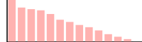

:imagesdir: ./
:!webfonts:
:stylesheet: ../web/adoc.css
:table-caption!:
:reproducible:
:nofooter:

Dear Nijika,

== Introduction

In the interest of helping STARRY LiveHouse evaluate and select new music to be played at the final party, we present several models for music evaluation. Because we are not able to know the music that will be available on the day of the final party, we have in anticipation trained several models on a catalog of existing music. The training catalog contains each track's danceability score and well as a variety of different characteristics. We hope our models will be able to help the DJ evaluate the danceability of each track that will be available on the day of the party. We assume each track's characteristics will be available for making this evaluation

== The Training Catalog

The training catalog of tracks (ie. the tranining data set) serves as the basis on which we build and tune our algorithms for predicting the danceability of new tracks that come in for evaluation. The training data provides a large variety of information about each track - organized across 28 categories (ie. features).

General statistics about the data:

----
;;    |        :col-name | :datatype |           :min |           :mean |           :max | :standard-deviation |
;;    |------------------|-----------|---------------:|----------------:|---------------:|--------------------:|
;;    |     Danceability |  :float64 |  0.0000000E+00 |  4.58602213E+00 | 9.00000000E+00 |      2.85898047E+00 |
;;    |           Energy |  :float64 |  8.3654270E-15 |  3.35839161E-01 | 1.00000000E+00 |      2.42682490E-01 |
;;    |              Key |  :float64 |  0.0000000E+00 |  5.23160351E+00 | 1.00000000E+01 |      3.45698563E+00 |
;;    |         Loudness |  :float64 | -4.6251000E+01 | -7.56137045E+00 | 8.29000000E-01 |      4.54094367E+00 |
;;    |      Speechiness |  :float64 |  0.0000000E+00 |  9.54616104E-02 | 9.64000000E-01 |      1.03067790E-01 |
;;    |     Acousticness |  :float64 |  1.3676310E-18 |  1.14840436E-01 | 9.88047936E-01 |      2.21515989E-01 |
;;    | Instrumentalness |  :float64 |  0.0000000E+00 |  5.49337142E-02 | 1.00000000E+00 |      1.91391947E-01 |
;;    |         Liveness |  :float64 |  3.0486250E-06 |  3.37454170E-02 | 1.00000000E+00 |      1.14862495E-01 |
;;    |          Valence |  :float64 |  0.0000000E+00 |  5.25841770E-01 | 9.93000000E-01 |      2.44911882E-01 |
;;    |            Tempo |  :float64 |  0.0000000E+00 |  1.20937819E+02 | 2.43372000E+02 |      2.96652253E+01 |
;;    |      Duration_ms |  :float64 |  3.0985000E+04 |  2.22830746E+05 | 4.58148300E+06 |      1.21165872E+05 |
;;    |            Views |  :float64 |  2.6000000E+01 |  8.79109559E+07 | 5.77379841E+09 |      2.52391810E+08 |
;;    |            Likes |  :float64 |  0.0000000E+00 |  6.48506362E+05 | 4.01476180E+07 |      1.72615677E+06 |
;;    |           Stream |  :float64 |  6.5740000E+03 |  1.29042648E+08 | 3.38652029E+09 |      2.41768149E+08 |
;;    |       Album_type |   :string |                |                 |                |                     |
;;    |         Licensed |   :string |                |                 |                |                     |
;;    |   official_video |   :string |                |                 |                |                     |
;;    |               id |    :int16 |  0.0000000E+00 |  8.58450000E+03 | 1.71690000E+04 |      4.95669640E+03 |
;;    |            Track |   :string |                |                 |                |                     |
;;    |            Album |   :string |                |                 |                |                     |
;;    |              Uri |   :string |                |                 |                |                     |
;;    |      Url_spotify |   :string |                |                 |                |                     |
;;    |      Url_youtube |   :string |                |                 |                |                     |
;;    |         Comments |  :float64 |  0.0000000E+00 |  2.81032121E+04 | 1.60831380E+07 |      2.14292202E+05 |
;;    |      Description |   :string |                |                 |                |                     |
;;    |            Title |   :string |                |                 |                |                     |
;;    |          Channel |   :string |                |                 |                |                     |
;;    |         Composer |   :string |                |                 |                |                     |
;;    |           Artist |   :string |                |                 |                |                     |
----

Note how some features are represented by `float64` values, while others have `string` values

=== Data Holes

Due to inconsistencies in the data collected into the catalog, not all features are available for each track. We tabulate the percentage of each column that is not defined

.Percentage of each feature that is NULL (ie. has no defined value)
----
;; => [[:Views 15]
;;     [:Liveness 14]
;;     [:official_video 15]
;;     [:Acousticness 15]
;;     [:Speechiness 14]
;;     [:Key 15]
;;     [:Valence 14]
;;     [:Title 15]
;;     [:Composer 14]
;;     [:Channel 14]
;;     [:Instrumentalness 15]
;;     [:Track 14]
;;     [:Danceability 0]
;;     [:Album 15]
;;     [:Duration_ms 15]
;;     [:Album_type 14]
;;     [:Stream 14]
;;     [:id 0]
;;     [:Comments 15]
;;     [:Url_spotify 15]
;;     [:Energy 14]
;;     [:Loudness 14]
;;     [:Description 15]
;;     [:Uri 14]
;;     [:Tempo 14]
;;     [:Licensed 15]
;;     [:Url_youtube 14]
;;     [:Artist 14]
;;     [:Likes 15]]
----

The result shows an unusually consistent distribution of holes in the data (suggesting an artificial origin...). This removes a potential source of added complexity as all features are affected equally

=== Danceability

Danceability is the general metric we are trying to predict. This is a numerical value from 0.0 to 9.0. Values are only available in integer increments [0.0, 1.0, ...,  9.0]. One can treat these as 10 different categories, but it's more correct to think of this as a continious linear scale that has undergone rounding (for the sake of easy human consumption).

Interestingly Danceability is very evenly distributed on the 0-9 range. This suggests it was not created by user input but is some synthetic metric created by TAs

image:Danceability.svg[]

=== Features

We separate features into two general categories - numerical and non-numerical features

Numerical features are ones represented with either a integer or floating point value. These include things like the : *Loudness*, *Speechiness* and *Acousticness*. These values can be used directly

The distributions for a few notable ones have the following shapes:

[.columns]
====
[.column]
.Valence
image::Valence.svg[]

[.column]
.Tempo

[.column]
.Key

[.column]
.Energy

[.column]
.Loudness
image::Loudness.svg[]
====

Most other features are dominated by near-zero values

== Method 1 - Linear Regression

To establish a baseline and for further analysis, we first implement the most basic learning algorithm we can imagine - the *linear regression*. This allows us to get a general sense for how challenging the given dataset is and it allows us to have an initial score that we can try to beat.

Linear regression simply fits an N-dimension hyperplane using the pseudo-inverse

=== Data preparation

For simplicity we constrain ourselves to the 16 numerical features in the catalog. Columns containing strings are for the time being simply discarded. As mentioned previously, the data contains holes. We fill the holes using the average of the values for each column (ignoring other NULL holes). This will hopefully minimize any bias (vs. for instance setting all the values to zero or one).

=== Result

We characterize the model performance using `sklearn.metrics.precision_recall_fscore_support` - which helps us put together the following metrics:

.Metrics
 - *Features*:: 16
 - *score*:: 0.350689
 - *accuracy*:: 0.145894
 - *precision*:: 0.133607
 - *recall*:: 0.097358
 - *f1*:: 0.088267

.Definitions
- *Features*:: is the totaly number of dimensions/columns being considered
- *Score*:: "Return the coefficient of determination of the prediction" This is a statistical evaluation of the performance of the model on the training data. The documentation further reads: ”The coefficient of determination is defined as
, where is the residual sum of squares ( (y_true - y_pred)^2).sum() and is the total sum of squares ( (y_true - y_true.mean() )^2 ).sum(). The best possible score is 1.0 and it can be negative (because the model can be arbitrarily worse). A constant model that always predicts the expected value of y, disregarding the input features, would get a score of 0.0.“
- *Accuracy*:: - "In multilabel classification, this [..] computes subset accuracy: the set of labels predicted for a sample must exactly match the corresponding set of labels in y_true."
- *Precision*:: "The precision is the ratio tp / (tp + fp) where tp is the number of true positives and fp the number of false positives. The precision is intuitively the ability of the classifier not to label a negative sample as positive."
- *Recall*:: "The recall is the ratio tp / (tp + fn) where tp is the number of true positives and fn the number of false negatives. The recall is intuitively the ability of the classifier to find all the positive samples."
- *f1*:: "The F-beta score can be interpreted as a weighted harmonic mean of the precision and recall, where an F-beta score reaches its best value at 1 and worst score at 0."

.Quoted excerpts are from the Scikit documentation:
- https://scikit-learn.org/stable/modules/generated/sklearn.linear_model.LinearRegression.html
- https://scikit-learn.org/stable/modules/generated/sklearn.metrics.accuracy_score.html#sklearn.metrics.accuracy_score
- https://scikit-learn.org/stable/modules/generated/sklearn.metrics.precision_recall_fscore_support.html

== Method 2 - Logistic Regression

Since the Danceability score is constrained to a fixed [0-9] range, the linear regression is not ideally suited for learning. The trained system is able to erroneously output values outside of the valid range. This is a situation where something like the logistic equation can help provide a bound on the output space

=== Hole filling revisited

When looking at some feature like *Key*, we can see it is bimodal, with many songs at high and low Keys. Relatively fewer tracks are found in the middle range. Hence when filling in missing values, using the *Key* average would produce an unlikely value. Furthermore, while it's hard to introspect the higher dimensional space of all the features, one imagines music clusters according to genre and similarity. For instance inution tells us that high tempo music is more likely to be loud.

To fill in missing values, instead of using a global average, we would ideally find tracks with similar characteristics in the catalog and then fill in our missing value based on these "neighbours". We implement a simple version of this concept. When we find a missing feature we look through all the tracks that have this missing feature and finding the one that is closest in the N-dimensional feature space. We then simply copy over the value into our empty spot.

The last complication is that since missing values occure at a relativel high rate (~15%), we are likely to have other missing values in other features of the track. So we need a method to estimate the distance between tracks with incomplete information. We accomplish this by calculating a Manhattan/L1 norm and then normalizing the value by the number of dimensions involved. In other words we calculate the distance between two track with the dimensions available (sum of the differences of each coocurring feature), and then divide by the number of dimensions. Thereby irrespective of how many features are missing, we can generate an estimate of the distance that is of similar magnitude.

Hole filling code is available here: https://github.com/kxygk/mlfinal/blob/master/stat.clj

=== Dealing with Strings

Non-numerical features are those represented with a character string. These include things like: the *Description*, *Title*, *Composer* and *Artist*. Naturally these encode a lot of relevant information when comparing tracks. But these values present an extra challenge as they lack a meaningful numerical representation. The binary representation of the strings do not correspond to any "closeness" between values. For instance a change in capitalization could lead to two values having drastically different binary representations. To generate more meaningful and directly useable values we convert each string to a vector representation using the general purpose pre-trained *bert2vec* neural network model.

This is provided to us by the HuggingFace project: https://huggingface.co/docs/transformers/model_doc/bert-generation

This model allows us to transform each strings in to a set of numerical columns. The number of columns is in the thousands, and it makes further training impractical. We reduce the number of dimensions by doing a simple linear regression between bert-generated-vectors and our target Danceability. We keep X amount of features/dimensions and discard the rest

Tuning of the discard parameter showed us that just keeping approximately X=125 features generates optimal results accross all models - with different models exhibiting different degrees of sensitivity. The Logistic Regression model is particularly insensitive and generates good results (an accuracy of 0.11269) with both just 80 vectors as well as 250 vectors. Interpreting this result is challenging - but it suggests that the Logistic Regression model is not able to leverage the vectorized strings as well as other models and relies more heavily on the numeric data to yield good performance

We also evaluated the *doc2vec* model, which similarly does a string to vector conversion, but it gave us inferior results

== Method 3 - SVM

We next explore an alternate strategy of replacing the regression method with a classification method. As we explored during the course, classification seems to provide us with a much larger variety of different algorithms. If we treat the different danceability scores as quantized groups, then it should be possible to guide our learning to be able to distinguish between different danceablity levels ( 0,1 .., 9)

The prime candidate for classification is the Support Vector Machine. We employ the SVM though the Python library `sklearn.svm.LinearSVC` . See: https://scikit-learn.org/stable/modules/generated/sklearn.svm.LinearSVC.html

As illustrated in the documentation, this provides a wrapper around `liblinear` (ie. this will use the linear kernel and a hard margin). As previously, we vary the amount of string-equivalent features to include and we observe a noteable change in the resulting accuracy. This suggests to us that the method is more actively employing information in the BERT vectors.

.Bert2Vec features selection sensitivity
- *Features*:  80 ->	*Accuracy* 0.083576
- *Features*: 100 ->	*Accuracy* 0.106290
- *Features*: 125 ->	*Accuracy* 0.090565
- *Features*: 150 ->	*Accuracy* 0.101340
- *Features*: 175 ->	*Accuracy* 0.112405
- *Features*: 200 ->	*Accuracy* 0.096389
- *Features*: 250 ->	*Accuracy* 0.106872

The resulting accuracy provides a noteable improvement in performance when compared with the Logistic Method

== Method 4 - Decision Trees

https://scikit-learn.org/stable/modules/tree.html

Decision Trees provide a way to aggregate many simpler models into one powerful model. This has the potential to build a very flexible model that can accomodate unusual data

The resulting accuracy is significantly worse than simpler models. Not surprisingly it is not sensitive to the number of BERT vectors selected:

.Bert2Vec features selection sensitivity
- *Features*:  80 ->	*Accuracy* 0.207338
- *Features*: 100 ->	*Accuracy* 0.205882
- *Features*: 125 ->	*Accuracy* 0.203553
- *Features*: 150 ->	*Accuracy* 0.210250
- *Features*: 175 ->	*Accuracy* 0.204135
- *Features*: 200 ->	*Accuracy* 0.209086
- *Features*: 250 ->	*Accuracy* 0.205882

Our guess is that the model is more suitable for very non-linear data. Danceability is likely a relatively linear problem in comparison. One can imagine louder, faster pace music with more vocals will generally be more danceable. In this higher dimensional space one doesn't imagine there are too many segregated islands where music is danceable.

== Method 5 - GradientBoostingClassifier

https://scikit-learn.org/stable/modules/generated/sklearn.ensemble.GradientBoostingClassifier.html#sklearn-ensemble-gradientboostingclassifier

This provides an alternate tree based classifier - where at each stage you are doing multiclass classification. This method seems to suffer from the same issues as the Decision Trees. This is also likely having issues b/c of the strong emphasis on classification

.Bert2Vec features selection sensitivity
- *Features*:  80 ->	*Accuracy* 0.258591
- *Features*: 100 ->	*Accuracy* 0.261794
- *Features*: 125 ->	*Accuracy* 0.261794
- *Features*: 150 ->	*Accuracy* 0.260920
- *Features*: 175 ->	*Accuracy* 0.265871
- *Features*: 200 ->	*Accuracy* 0.261794
- *Features*: 250 ->	*Accuracy* 0.258008

== Method 6 - RandomForestClassifier

https://scikit-learn.org/stable/modules/generated/sklearn.ensemble.RandomForestClassifier.html#sklearn-ensemble-randomforestclassifier

The last tree based method we tried, again gives poor results. And once again we suspect the same issues arose here.

.Bert2Vec features selection sensitivity
- *Features*:  80 ->	*Accuracy* 0.274607
- *Features*: 100 ->	*Accuracy* 0.262959
- *Features*: 125 ->	*Accuracy* 0.266453
- *Features*: 150 ->	*Accuracy* 0.263250
- *Features*: 175 ->	*Accuracy* 0.262376
- *Features*: 200 ->	*Accuracy* 0.258591
- *Features*: 250 ->	*Accuracy* 0.257135

== Discussion

As we see from the results, more complex models do not seem to provide any clear performance benefits over simpler models. The Linear model provides a "useable" performance, but is notably lagging behind other candidates. The logistic equation is not a computationally taxing transformation so it doesn't present a serious step up in terms of complexity - but it does yeild substantial improvements. Furthermore the linear model, unlike the logistic one, suffers from possibility of yielding values outside the valid range

Both the Logistic Regression and SVM models provide good robust results. They demonstrate that this class of problems can be fluidly reformulated from a regression problem to a classification problem while maintaining good robust learning. While the SVM does generate a better accuracy, the Logistic model may be preferrable if many new tracks need to evaluated at once, or the model needs to be executed in a constrained environment (ex: microcontroller or low power device). The performance penalty is minor and the danger of overfitting is minimized. I suggest STARRY LiveHouse evaluate their requirements and select one model among these two.

For completeness an additional 3 more complex tree based models were evaluated and were found to provide inadequate performance. We provide them here for completeness and as a future reference. The tree based methods seem more appropriate when you have more complex nonlinear relationships between the features. However our human intuition tells us that the Danceability of a song generally correlates (in a stochastic way) with certain properties of the song.

== Workload

Everything was done collaboratively and in active discussion with each other. The general work balance was as follows

- 何品諭 :: - Wrote all the machine learning algorithms and managed the Google Colab workspace. Did all the parameter tuning and research into what's available in Scikit
- George Kontsevich (康笑愚) :: - Did the statistical analysis of the data, implemented a nearest-neighbour hole filling algorithm, wrote the report
