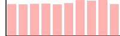
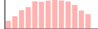

:imagesdir: ./
:!webfonts:
:stylesheet: ../web/adoc.css
:table-caption!:
:reproducible:
:nofooter:

Dear Nijika,

== Introduction

In the interest of helping STARRY LiveHouse evaluate and select new music to be played at the final party, we present several models for music evaluation. Because we are not able to know the music that will be available on the day of the final party, we have in anticipation trained several models on a catalog of existing music. The training catalog contains each track's danceability score and well as a variety of different characteristics. We hope our models will be able to help the DJ evaluate the danceability of each track that will be available on the day. We assume each track's characteristics will be available for making this evaluation

== The Training Catalog

The training catalog of tracks (ie. the tranining data set) serves as the basis on which we build and tune our algorithms for prediction the danceability of new tracks that come in for evaluation. The training data provides a large variety of information about each track - organized across 28 categories (ie. features). Due to inconsistencies in the data collected into the catalog, not all features are available for each track

General statistics about the data:

----
;;    |        :col-name | :datatype |           :min |           :mean |           :max | :standard-deviation |
;;    |------------------|-----------|---------------:|----------------:|---------------:|--------------------:|
;;    |     Danceability |  :float64 |  0.0000000E+00 |  4.58602213E+00 | 9.00000000E+00 |      2.85898047E+00 |
;;    |           Energy |  :float64 |  8.3654270E-15 |  3.35839161E-01 | 1.00000000E+00 |      2.42682490E-01 |
;;    |              Key |  :float64 |  0.0000000E+00 |  5.23160351E+00 | 1.00000000E+01 |      3.45698563E+00 |
;;    |         Loudness |  :float64 | -4.6251000E+01 | -7.56137045E+00 | 8.29000000E-01 |      4.54094367E+00 |
;;    |      Speechiness |  :float64 |  0.0000000E+00 |  9.54616104E-02 | 9.64000000E-01 |      1.03067790E-01 |
;;    |     Acousticness |  :float64 |  1.3676310E-18 |  1.14840436E-01 | 9.88047936E-01 |      2.21515989E-01 |
;;    | Instrumentalness |  :float64 |  0.0000000E+00 |  5.49337142E-02 | 1.00000000E+00 |      1.91391947E-01 |
;;    |         Liveness |  :float64 |  3.0486250E-06 |  3.37454170E-02 | 1.00000000E+00 |      1.14862495E-01 |
;;    |          Valence |  :float64 |  0.0000000E+00 |  5.25841770E-01 | 9.93000000E-01 |      2.44911882E-01 |
;;    |            Tempo |  :float64 |  0.0000000E+00 |  1.20937819E+02 | 2.43372000E+02 |      2.96652253E+01 |
;;    |      Duration_ms |  :float64 |  3.0985000E+04 |  2.22830746E+05 | 4.58148300E+06 |      1.21165872E+05 |
;;    |            Views |  :float64 |  2.6000000E+01 |  8.79109559E+07 | 5.77379841E+09 |      2.52391810E+08 |
;;    |            Likes |  :float64 |  0.0000000E+00 |  6.48506362E+05 | 4.01476180E+07 |      1.72615677E+06 |
;;    |           Stream |  :float64 |  6.5740000E+03 |  1.29042648E+08 | 3.38652029E+09 |      2.41768149E+08 |
;;    |       Album_type |   :string |                |                 |                |                     |
;;    |         Licensed |   :string |                |                 |                |                     |
;;    |   official_video |   :string |                |                 |                |                     |
;;    |               id |    :int16 |  0.0000000E+00 |  8.58450000E+03 | 1.71690000E+04 |      4.95669640E+03 |
;;    |            Track |   :string |                |                 |                |                     |
;;    |            Album |   :string |                |                 |                |                     |
;;    |              Uri |   :string |                |                 |                |                     |
;;    |      Url_spotify |   :string |                |                 |                |                     |
;;    |      Url_youtube |   :string |                |                 |                |                     |
;;    |         Comments |  :float64 |  0.0000000E+00 |  2.81032121E+04 | 1.60831380E+07 |      2.14292202E+05 |
;;    |      Description |   :string |                |                 |                |                     |
;;    |            Title |   :string |                |                 |                |                     |
;;    |          Channel |   :string |                |                 |                |                     |
;;    |         Composer |   :string |                |                 |                |                     |
;;    |           Artist |   :string |                |                 |                |                     |
----

Note how some features are represented by `float64` values, while others have `string` values

=== Danceability

Danceability is the general metric we are trying to predict. This is a numerical value from 0.0 to 9.0. Values are only available in integer increments [0.0, 1.0, ...,  9.0]. While these seem to present 10 different categories, it's more correct to think of this as a continious linear scale that has undergone rounding (for the sake of easy human consumption). We will treat this as a regression class problem

Interestingly Danceability is mostly evenly distributed on the 0-9 range. This suggests it was not created by user input but is some synthetic metric created by some higher beings (like the TAs)

=== Features

We separate features into two general categories - numerical and non-numerical features

Numerical features are ones represented with either a integer or floating point value. These include things like the : *Loudness*, *Speechiness* and *Acousticness*. These values can be used directly

The distributions for a few notable ones is as follows:

.Valence

.Tempo
image::Tempo.svg[]

.Key
image::Key.svg[]

.Energy
image::Energy.svg[]

.Loudness

All other features are dominated by near-zero values

Non-numerical features are those represented with a character string. These include things like: the *Description*, *Title*, *Composer *and *Artist*. These values present an extra challenge as they lack a meaningful numerical representation. The binary representation of the strings do not correspond to any "closeness" between values. For instance a change in capitalization could lead to two values having drastically different binary representations. To generate more meaningful and directly useable values we convert each string to a vector representation using the general purpose pre-trained doc2vec neural network model. This allows us to replace each column of strings in the original data with a set of numerical columns

TODO:: Add details about how we run doc2vec

== Data holes

Our training data is unfortunately systematically missing large amounts of features. An analysis of the distribution of these missing features shows that every features is consistently missing 14-15% of the time. Because of the large amount of features, there are few tracks that contain all possible features.

TODO: Are the holes uncorrelated?
TODO: How many songs have all features

== Model 1: Linear Regression

The first model we use is the linear regression model. The model is relatively simple and relies on trying to find a linear relationship between the different features the song's final danceability. This presents us with a very fast and inuitive method that's not prone to overfitting. This means the in-sample error should approximate the model's general performance on out of sample (ie. future) data.

TODO:: Summarize result
TODO:: Give validation result

As we can see the validation error is quite close to the in-sample error, supporting our understanding that the linear regression model is not prone to overfitting.

This result will act as a baseline for us when evaluating other methods. We should be able to outperform this model. If we are not, then we can know that we likely have an issue with in our implementation

== Model 2: Regularized Polynomial Regression

The next model to naturally try would be a regularized polynomial regression. This should provide moderately better results but is likely to introduce overfitting. The fitting parameters Q and C will need to be specified. Q is an integer value which indicates the polynomial order, while C is a regularization parameter which minimizes the effects of overfitting. Both parameters are tuned by adjusting and observing changes in the validation error. The validation

== Model 3: TODO CHOOSE SOMETHING EXCITING...

The last model we try is

Danceability 	Energy 	Key 	Loudness 	Speechiness 	Acousticness 	Instrumentalness 	Liveness 	Valence 	Tempo 	... 	Album 	Uri 	Url_spotify 	Url_youtube 	Comments 	Description 	Title 	Channel 	Composer 	Artist
